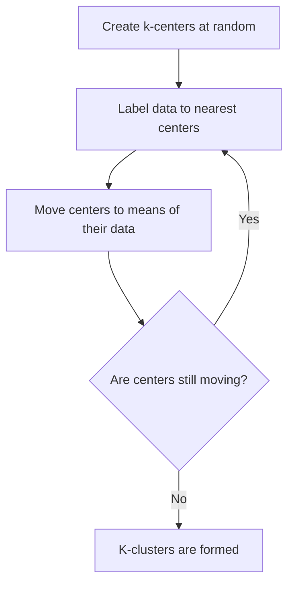

# Python program to implement unsupervised learning algorithm K-Means 


## Project description

The program generates k number of blobs using sklearn utility "make_blobs". User is asked to input number of clusters, number of data instances and number of iterations. First k centers are generated at random. Once k-centers exist, data are labelled to one of these clusters according to their proximity with these centers. Once initial clusters are set, centers move to each cluster's mean values. Over a few iterations, cluster centers converge. The datasets are displayed with different colors belonging to different clusters. The resulting animation with cluster centers pops up in Google Chrome. 



## Execution

```bash
gh repo clone sauravdwivedi/Machine-Learning
cd Machine-Learning && cd K-Means
python3 -m venv k-means
source k-means/bin/activate
pip3 install -r requirements.txt
python3 k-means.py
```

### Open in browser

```bash
open -a 'Google Chrome' clusters.gif
```
